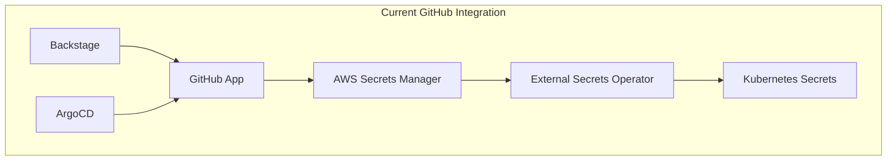
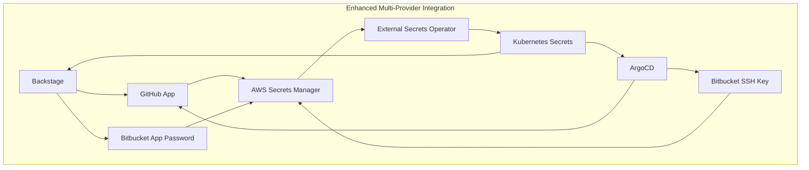

# Bitbucket Integration for CNOE Reference Implementation

## 📋 Overview

This repository contains a comprehensive plan and implementation guide for integrating Bitbucket support into the CNOE AWS Reference Implementation. The integration enables organizations to use Bitbucket as their Git provider for both Backstage and ArgoCD operations, either alongside or instead of GitHub.

## 🎯 Project Goals

- **Multi-Provider Support**: Enable simultaneous GitHub and Bitbucket integration
- **Backward Compatibility**: Maintain existing GitHub functionality
- **Zero-Downtime Migration**: Allow gradual transition between Git providers
- **Security**: Implement secure authentication using existing infrastructure
- **Flexibility**: Support both Bitbucket Cloud and Bitbucket Server/Data Center

## 📚 Documentation Structure

### 📖 Core Documents

| Document | Purpose | Target Audience |
|----------|---------|-----------------|
| [**Bitbucket Integration Plan**](docs/bitbucket-integration-plan.md) | High-level architectural plan and strategy | Technical leadership, architects, project managers |
| [**Implementation Guide**](docs/bitbucket-implementation-guide.md) | Detailed technical implementation instructions | Developers, DevOps engineers |
| [**Integration Summary**](docs/bitbucket-integration-summary.md) | Executive summary and overview | All stakeholders |

### 🔍 Quick Navigation

- **🎯 Want to understand the approach?** → [Integration Summary](docs/bitbucket-integration-summary.md)
- **📋 Need the detailed plan?** → [Integration Plan](docs/bitbucket-integration-plan.md)
- **🛠️ Ready to implement?** → [Implementation Guide](docs/bitbucket-implementation-guide.md)
- **❓ Have questions?** → [Troubleshooting](#troubleshooting) section below

## 🏗️ Current Architecture

### GitHub Integration (Existing)


### Proposed Multi-Provider Architecture


## 🚀 Quick Start

### Prerequisites
- ✅ Existing CNOE Reference Implementation with GitHub
- ✅ Bitbucket workspace (Cloud or Server)
- ✅ AWS Secrets Manager access
- ✅ Kubernetes cluster with External Secrets Operator

### Step-by-Step Setup

1. **📋 Review the Plan**
   ```bash
   # Read the integration plan
   cat docs/bitbucket-integration-plan.md
   ```

2. **🔧 Prepare Configuration**
   ```bash
   # Copy template and configure
   cp private/bitbucket-config.yaml.template private/bitbucket-config.yaml
   # Edit with your Bitbucket credentials
   ```

3. **⚙️ Update Config**
   ```bash
   # Enable Bitbucket in config.yaml
   yq eval '.git_providers.bitbucket.enabled = true' -i config.yaml
   yq eval '.git_providers.bitbucket.workspace = "your-workspace"' -i config.yaml
   ```

4. **🔐 Create Secrets**
   ```bash
   # Enhanced script handles both GitHub and Bitbucket
   ./scripts/create-config-secrets.sh
   ```

5. **🚀 Deploy**
   ```bash
   # Bitbucket integration is automatically deployed as part of main installation
   ./scripts/install.sh
   # OR for idpbuilder installations:
   # ./scripts/install-using-idpbuilder.sh
   ```

6. **✅ Validate**
   ```bash
   # Validate the integration
   ./scripts/validate-bitbucket-integration.sh
   ```

## 🔐 Authentication Methods

### Backstage Integration
- **Primary**: App Password (Bitbucket Cloud)
- **Alternative**: Personal Access Token (Bitbucket Server)
- **Security**: Scoped permissions, easy rotation

### ArgoCD Integration
- **Primary**: SSH Key (reuse existing infrastructure)
- **Alternative**: App Password / Personal Access Token
- **Security**: Private key authentication, repository access

## 🏃‍♂️ Implementation Phases

### Phase 1: Foundation (Weeks 1-2)
- [ ] Enhanced configuration system
- [ ] Secret management implementation
- [ ] Basic Backstage integration
- [ ] ArgoCD repository configuration

### Phase 2: Core Features (Weeks 3-4)
- [ ] Template system updates
- [ ] Webhook integration
- [ ] Installation script enhancements
- [ ] Basic testing and validation

### Phase 3: Advanced Features (Weeks 5-6)
- [ ] Multi-provider template support
- [ ] Enhanced security features
- [ ] Comprehensive testing suite
- [ ] Migration tools and utilities

### Phase 4: Validation & Release (Weeks 7-8)
- [ ] End-to-end integration testing
- [ ] Performance validation
- [ ] Security audit
- [ ] Documentation finalization

## 🛠️ Key Technical Changes

### Configuration Schema
```yaml
# Enhanced config.yaml structure
git_providers:
  github:
    enabled: true
    repo:
      url: "https://github.com/org/repo"
      revision: "main"
    integration_type: "github_app"
  bitbucket:
    enabled: true
    repo:
      url: "https://bitbucket.org/workspace/repo"
      revision: "main"
    integration_type: "app_password"
    workspace: "workspace-name"
```

### Secret Management
- **New Secret**: `cnoe-ref-impl/bitbucket-app` in AWS Secrets Manager
- **Contents**: Username, app password, SSH keys, server URL, workspace
- **Integration**: External Secrets Operator for automatic Kubernetes secret creation

### File Changes
| File | Purpose | Type |
|------|---------|------|
| `config.yaml` | Enhanced multi-provider configuration | Modified |
| `packages/backstage/manifests/external-secrets-bitbucket.yaml` | Bitbucket secret management | New |
| `packages/argo-cd/manifests/argo-cd-bitbucket-app.yaml` | ArgoCD Bitbucket integration | New |
| `packages/backstage/chart/templates/configmap.yaml` | Enhanced Backstage configuration | Modified |
| `scripts/create-config-secrets.sh` | Enhanced secret creation | Modified |

## 📊 Benefits

### 🏢 Organizational Benefits
- **Flexibility**: Choose Git provider based on organizational needs
- **Migration Support**: Gradual transition between providers
- **Cost Optimization**: Leverage existing Bitbucket licenses
- **Compliance**: Meet organizational Git provider requirements

### 👩‍💻 Developer Benefits
- **Familiar Workflows**: Use existing Bitbucket processes
- **Consistent Experience**: Same Backstage/ArgoCD experience regardless of provider
- **Template Flexibility**: Provider-specific software templates
- **Easy Onboarding**: Streamlined setup process

### 🔧 Operations Benefits
- **Unified Management**: Single secret management approach
- **Monitoring**: Consistent logging and monitoring
- **Resilience**: Multi-provider reduces single points of failure
- **Automation**: Automated setup and validation

## 🔒 Security Features

### Authentication Security
- **App Passwords**: Limited scope, easy rotation
- **SSH Keys**: Secure for ArgoCD, reuse existing infrastructure
- **Secret Rotation**: Automated rotation capabilities
- **Least Privilege**: Minimal required permissions

### Access Control
- **Repository Access**: Read-only for ArgoCD synchronization
- **Workspace Permissions**: Controlled by Bitbucket settings
- **Webhook Security**: Secure endpoint validation

## 📈 Migration Strategies

### New Installations
1. Select Git provider during setup
2. Configure provider-specific credentials
3. Run automated setup scripts
4. Validate functionality

### Existing GitHub Installations
1. **Backup**: Create configuration backup
2. **Migrate**: Run configuration migration scripts
3. **Integrate**: Add Bitbucket alongside GitHub
4. **Test**: Validate both providers work
5. **Transition**: Gradually move repositories
6. **Cleanup**: Remove GitHub when ready

## 🧪 Testing Strategy

### Testing Levels
- **Unit Tests**: Configuration validation, secret handling
- **Integration Tests**: End-to-end repository operations
- **Provider Tests**: Bitbucket Cloud/Server specific tests
- **Security Tests**: Authentication and authorization validation

### Validation Scripts
```bash
# Check external secrets
kubectl get externalsecrets -n backstage
kubectl get externalsecrets -n argocd

# Validate secret contents
kubectl get secret bitbucket-integration -n backstage -o yaml

# Check application logs
kubectl logs -n backstage deployment/backstage
kubectl logs -n argocd deployment/argocd-server
```

## 🔧 Troubleshooting

### Common Issues

#### Authentication Failures
- **Symptoms**: Unable to access Bitbucket repositories
- **Solutions**:
  - Verify app password has correct permissions
  - Check workspace name is correct
  - Ensure server URL is accessible
  - Validate credentials in AWS Secrets Manager

#### Secret Creation Failures
- **Symptoms**: External secrets not created
- **Solutions**:
  - Verify AWS credentials are configured
  - Check AWS Secrets Manager permissions
  - Ensure region is correct in config.yaml
  - Validate External Secrets Operator is running

#### ArgoCD Repository Access
- **Symptoms**: ArgoCD cannot sync from Bitbucket
- **Solutions**:
  - Verify SSH key is added to Bitbucket
  - Check repository URL format
  - Ensure repository exists and is accessible
  - Validate repository credentials in ArgoCD

### Debug Commands
```bash
# Check external secrets status
kubectl get externalsecrets -A

# Check ArgoCD repository connections
kubectl exec -n argocd deployment/argocd-server -- argocd repo list

# Check Backstage integration
kubectl logs -n backstage deployment/backstage --tail=100 | grep -i bitbucket

# Validate secret synchronization
kubectl get events -n backstage | grep externalsecret
```

## 🤝 Contributing

### Development Setup
1. Fork the repository
2. Create feature branch
3. Implement changes following the implementation guide
4. Add tests for new functionality
5. Update documentation
6. Submit pull request

### Code Standards
- Follow existing code patterns
- Include comprehensive tests
- Update documentation
- Validate security implications
- Test with both Bitbucket Cloud and Server

## 📋 Requirements

### System Requirements
- **Kubernetes**: 1.24+
- **ArgoCD**: 2.8+
- **Backstage**: 1.17+
- **External Secrets Operator**: 0.9+

### Access Requirements
- **Bitbucket**: Workspace admin access
- **AWS**: Secrets Manager permissions
- **Kubernetes**: Cluster admin access

### Network Requirements
- **Bitbucket Access**: HTTPS connectivity to Bitbucket
- **AWS Access**: HTTPS connectivity to AWS Secrets Manager
- **Webhook Access**: Inbound HTTPS for webhooks (optional)

## 📝 License

This project is licensed under the same terms as the CNOE Reference Implementation.

## 🆘 Support

### Documentation
- **Integration Plan**: [docs/bitbucket-integration-plan.md](docs/bitbucket-integration-plan.md)
- **Implementation Guide**: [docs/bitbucket-implementation-guide.md](docs/bitbucket-implementation-guide.md)
- **Integration Summary**: [docs/bitbucket-integration-summary.md](docs/bitbucket-integration-summary.md)

### Community
- **Issues**: GitHub Issues for bug reports and feature requests
- **Discussions**: GitHub Discussions for questions and community support
- **Slack**: CNOE Community Slack for real-time support

### Professional Support
- **Enterprise Support**: Contact CNOE team for enterprise support options
- **Consulting**: Professional services available for implementation assistance

---

## 📋 Project Status

**Current Status**: 📋 Planning Complete - Ready for Implementation  
**Estimated Timeline**: 8 weeks  
**Risk Level**: 🟢 Low (following established patterns)  
**Business Impact**: 🟢 High (enables Bitbucket adoption)

### Milestones
- [x] **Planning Phase**: Complete architecture and implementation plan
- [x] **Documentation**: Comprehensive documentation and guides
- [ ] **Implementation**: Code development and testing
- [ ] **Validation**: End-to-end testing and validation
- [ ] **Release**: Production-ready release

---

*This integration enables organizations to leverage Bitbucket as their Git provider within the CNOE Reference Implementation while maintaining all existing functionality and providing a smooth migration path.*